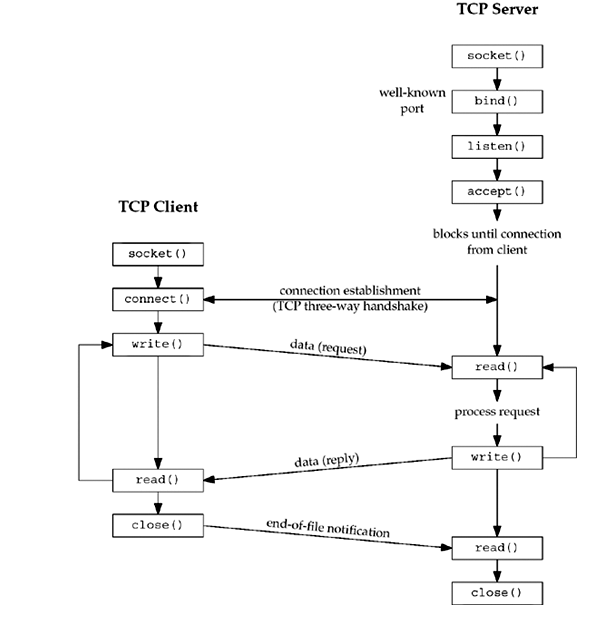

# I/O Models Study


Richard Stevens 《[UNIX® Network Programming Volume 1, Third Edition: The Sockets
Networking](https://notes.shichao.io/unp/ch6/)》 Chapter 6.2 "I/O Models"

> ## I/O Models
>
> We first examine the basic differences in the five I/O models that are available to us under Unix:
>
> - blocking I/O
>
> - nonblocking I/O
>
> - I/O multiplexing (`select` and `poll`)
>
> - signal driven I/O (`SIGIO`)
>
> - asynchronous I/O (the POSIX `aio_` functions)
>
> There are normally two distinct phases for an input operation:
>
> 1. Waiting for the data to be ready. This involves waiting for data to arrive on the network. When the packet arrives, it is copied into a buffer within the kernel.
> 2. Copying the data from the kernel to the process. This means copying the (ready) data from the kernel's buffer into our application buffer


基于 TCP 的网络编程开发分为服务器端和客户端两部分，常见的核心步骤和流程如下：




## 非阻塞IO

Linux中将 socket 设置为非阻塞模式有三种方法：

（1）创建socket的时候，指定socket是异步的，在type的参数中设置`SOCK_NONBLOCK`标志即可。

```c
int socket(int domain, int type, int protocol);
int s = socket(AF_INET, SOCK_STREAM | SOCK_NONBLOCK, IPPROTO_TCP);
```
（2）使用`fcntl`函数：
```c
int flags = fcntl(sfd, F_GETFL, 0);
fcntl(sockfd, F_SETFL, flags | O_NONBLOCK);
```
（3）使用`ioctl`函数：
```c
ioctl(sockfd, FIONBIO, 1);  //1:非阻塞 0:阻塞
```


**POSIX AIO及libaio的区别**

libaio是原生的 linux aio，行为更为低级；POSXI AIO是在用户空间模拟异步IO的功能,不需要内核的支持。

aio_*系列的调用是glibc提供的，是glibc用线程+阻塞调用来模拟的，性能很差。

## 编译步骤

1. 使用CMake编译

```shell
$ mkdir build
$ cd build
$ cmake ..
$ make
```

2. 使用Android NDK编译

需要把ndk-build命令放入系统全局变量中

```shell
$ cd jni
$ ndk-build
```

## 参考资料

- [TCP网络编程中connect()、listen()和accept()三者之间的关系](https://blog.csdn.net/tennysonsky/article/details/45621341)
- [Difference between POSIX AIO and libaio on Linux?](https://stackoverflow.com/questions/8768083/difference-between-posix-aio-and-libaio-on-linux)
- [Boost application performance using asynchronous I/O](https://www.ibm.com/developerworks/linux/library/l-async/) - IBM Developer
- [Linux异步IO+实例（POSIX IO与 libaio）](https://blog.csdn.net/lyh__521/article/details/50300379)
- [【NDK】编译生成直接运行在Android系统的可执行文件](http://sodino.com/2015/01/12/build-executables-for-android-using-NDK/)
